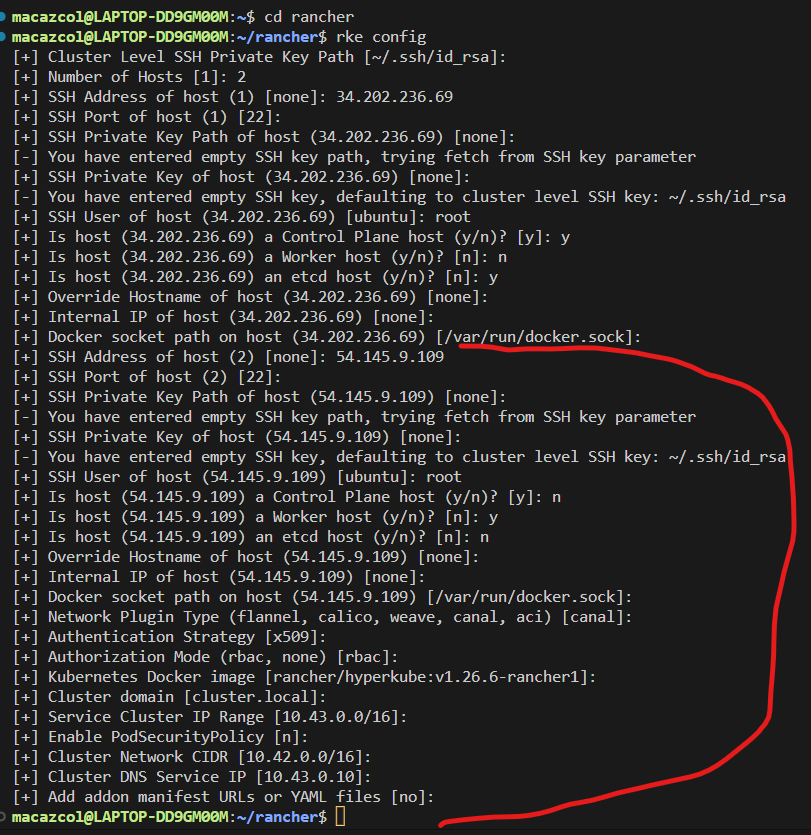

# Rancher
See link: [Releases: ](https://github.com/rancher/rke/releases)
See link: [RKE Kubernetes Installation: ](https://rke.docs.rancher.com/installation#download-the-rke-binary)

## Install Binaries
- I'm using WSL Ubuntu=20.04.3 LTS 
- Install binaries
- I installed:  rke_linux-arm64

## Install
- Move the rke_linux-arm64 download from local to WSL and convert

```
mv rke_linux-arm64 rke
chmod +x rke
```

***get rke version***

```
./rke --version
```

***get rke version from anywhere***

```
sudo mv rke /usr/sbin/
rke vaerion
```


## Create Hosts in Any environment
- I created 2 ubuntu instances in AWS as my hosts
- get their public IPS
- Install Docker on both hosts
- Make sure both Hosts have ssh access

***You can also get your host info by running command***

```
hostname -I
# Get system version
cat /etc/os-release    # Debian/Ubuntu
```

***you can install docker on ubuntu with this command***

```
curl https //releases.rancher.com/install-docker/20.10.sh | sh
```

[
34.202.236.69  # Master
54.145.9.109   # Slave
]

***change to root and run commands***

```
sudo su -
mkdir rancher
cd rancher
```

***create the rancher config using the prompt***

```
rke config
```


And for second server config, continue with prompt




***now a cluster.yaml file has created, Run it***

```
rke up
```

